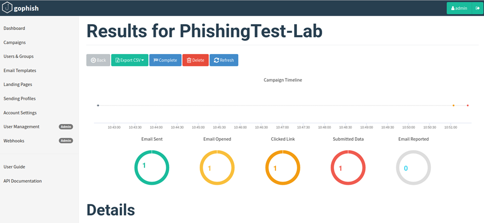

# Phishing Simulation & SOC Investigation Lab

An end-to-end phishing simulation and SOC investigation lab built in an isolated VMware environment deploying GoPhish attacker infrastructure, executing a credential harvesting campaign against a Windows victim, and investigating the full attack chain using Splunk and Windows Security event logs.

> This lab was independently designed and built as a personal home lab project not part of coursework. All infrastructure, attack simulation, detection logic, and documentation were self-directed.

> ⚠️ All activity conducted in an isolated VMware lab environment. No real systems, networks, or credentials were involved.

**MITRE ATT&CK:** T1566.002 · T1204.001 · T1078 · T1056.003  
**Tools:** GoPhish · Splunk Enterprise 9.3.2 · Splunk Universal Forwarder · VMware

---

## Lab Architecture

```
┌─────────────────────────────────────────────────────┐
│             Host-Only Network: 192.168.255.0/24     │
│                                                     │
│ ┌──────────────────┐      ┌──────────────────────┐  │
│ │ Ubuntu VM        │      │  Windows 10 VM       │  |
│ │ 192.168.255.131  │◄─────│  192.168.255.132     |  │   
│ │                  │      │                      │  │
│ │  • Splunk 9.3.2  │      │  • Victim Endpoint   │  │
│ │  • GoPhish 0.12.1│      │  • SUF 10.2.1        │  │
│ │  (Attacker Infra)│      │  • Log Source        │  │
│ └──────────────────┘      └──────────────────────┘  │
│                                                     │
|                                                     │
│                                                     │
└─────────────────────────────────────────────────────┘
```

**Log pipeline:** Windows 10 -> Splunk Universal Forwarder (port 9997) -> Splunk Enterprise on Ubuntu

---

## Attack Chain

```
[1] SETUP          [2] DELIVERY       [3] EXECUTION      [4] CAPTURE
GoPhish deployed -> Phishing email  -> Victim clicks  -> Credentials
on Ubuntu          crafted with       link at            harvested:
with fake IT       spoofed sender     22:50:44           john.doe /
portal page        and urgent CTA     Edge from          Password123
                                      explorer.exe
```



---

## MITRE ATT&CK Mapping

| Technique | ID | Tactic | Evidence |
|---|---|---|---|
| Phishing: Spearphishing Link | T1566.002 | Initial Access | GoPhish campaign with spoofed IT identity |
| User Execution: Malicious Link | T1204.001 | Execution | Edge spawned by explorer.exe at 22:50:44 (EventID 4688) |
| Valid Accounts | T1078 | Defense Evasion | Harvested credentials captured by GoPhish |
| Web Portal Capture | T1056.003 | Credential Access | Fake login form submitted to attacker server |

---

## Key Forensic Finding

The critical IOC was **Microsoft Edge launched directly from `explorer.exe`** captured via Windows Security EventID 4688:

```
Time:    2026-03-16 22:50:44
Process: C:\Program Files (x86)\Microsoft\Edge\Application\msedge.exe
Parent:  C:\Windows\explorer.exe
Host:    DESKTOP-FL9KRGR
```

This parent-child relationship is a reliable phishing execution signal which is distinct from normal browser launches triggered by other processes. It confirmed user interaction with the phishing link without requiring any network-level visibility.

---

## Splunk Detection Queries (SPL)

### T1566 - Browser Activity Timeline
```spl
index=main host="DESKTOP-FL9KRGR" EventCode=4688 New_Process_Name="*msedge*"
| table _time, New_Process_Name, Creator_Process_Name
| sort _time
```

### T1204 - User Execution from Explorer (Key IOC)
```spl
index=main host="DESKTOP-FL9KRGR" EventCode=4688 Creator_Process_Name="*explorer*"
| table _time, New_Process_Name, Creator_Process_Name
| sort _time
```

### T1078 - Account Logon Events
```spl
index=main host="DESKTOP-FL9KRGR" EventCode=4624
| table _time, Account_Name, Logon_Type, Source_Network_Address
| sort _time
```

### Credential Access Activity Over Time
```spl
index=main host="DESKTOP-FL9KRGR" EventCode=5379
| timechart count span=15m
```

---

## Splunk Dashboard

4-panel SOC investigation dashboard mapping each detection to a MITRE ATT&CK technique:


---

## Indicators of Compromise (IOCs)

| Type | Value | Context |
|---|---|---|
| IP | 192.168.255.131 | GoPhish phishing server |
| URL | `http://192.168.255.131/?rid=SrjXtqB` | Phishing landing page with campaign ID |
| Email | it-support@company-internal.com | Spoofed sender identity |
| Credentials | john.doe@company-internal.com / Password123 | Harvested credentials |
| Process | msedge.exe spawned by explorer.exe | Phishing click indicator (EventID 4688) |

---

## Detection Gaps & Lessons Learned

**Gaps identified:**
- No network-level URL visibility - Sysmon EventID 3 or a network tap would capture the actual phishing URL visited. Process creation logging confirmed execution but not destination.
- EventID 5379 field values (`Target_Name`, `User_Name`) were empty with default audit policy - advanced audit policy configuration required for full credential access logging.

**What worked:**
- Splunk Universal Forwarder via port 9997 was stable throughout (HEC abandoned due to persistent `code 17 - globally disabled` errors in this VMware environment)
- EventID 4688 process creation logging provided sufficient forensic evidence to confirm phishing execution without any network visibility
- GoPhish dashboard provided immediate confirmation of credential capture on the attacker side

---

## Production Detection Rules

```spl
// Alert: Browser spawned by explorer.exe outside business hours
index=main EventCode=4688
  (New_Process_Name="*chrome*" OR New_Process_Name="*msedge*" OR New_Process_Name="*firefox*")
  Creator_Process_Name="*explorer*"
| eval hour=strftime(_time, "%H")
| where hour < 8 OR hour > 18
| stats count by host, New_Process_Name, _time

// Alert: Credential manager access spike
index=main EventCode=5379
| bucket _time span=5m
| stats count by _time, host
| where count > 50
```

---

## Defensive Recommendations

| Control | Purpose |
|---|---|
| MFA on all accounts | Harvested passwords become useless without second factor |
| Email security gateway (Proofpoint, Mimecast) | URL rewriting and sandboxing before delivery |
| DNS filtering (Cisco Umbrella) | Block phishing domains at resolution |
| Sysmon with SwiftOnSecurity config | Network connection logging (EventID 3) for URL visibility |
| Regular phishing simulation training | Build user resilience against social engineering |

---

## Key Takeaway

This lab demonstrated that process creation logging (EventID 4688) alone is enough to confirm phishing execution, the parent-child relationship between explorer.exe and a browser is a reliable, low-noise signal that doesn't require network visibility. It also reinforced why MFA is the single most impactful control against credential harvesting attacks: no matter how convincing the phishing page, captured passwords are worthless without the second factor.

---

## Project Structure

```
├── README.md
├── Phishing_SOC_Incident_Report.docx
└── splunk/
    └── dashboard_phishing_soc.xml
```

---

## Related Project

[Splunk HOME SOC Detection Lab](https://github.com/DurgaRamireddy/Splunk-HOME-SOC-Detection-Lab---End-to-End-Alert-Lifecycle) - Full SOC Tier 1 alert lifecycle with brute force, PowerShell persistence detection, and 4-panel dashboard.

---

**Author:** Durga Sai Sri Ramireddy | MS Cybersecurity, University of Houston  
[](https://linkedin.com/in/durga-ramireddy)
[](https://github.com/DurgaRamireddy)
